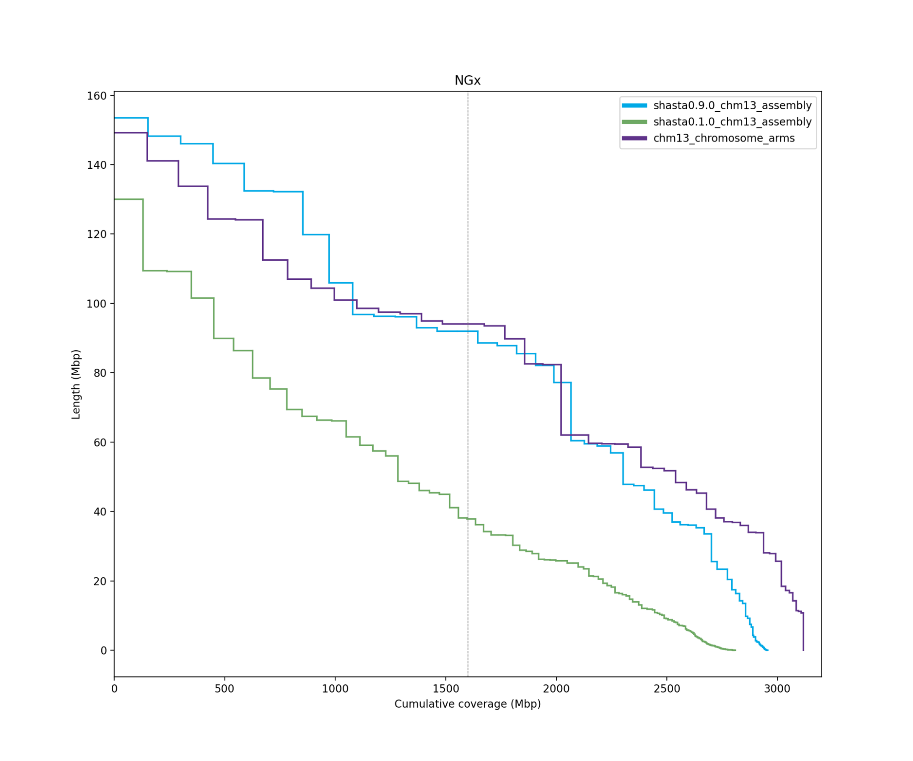
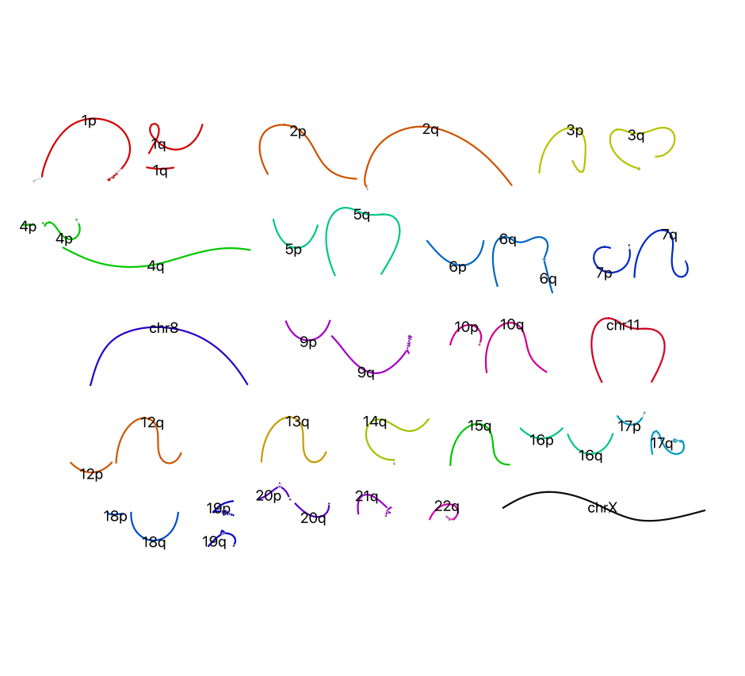
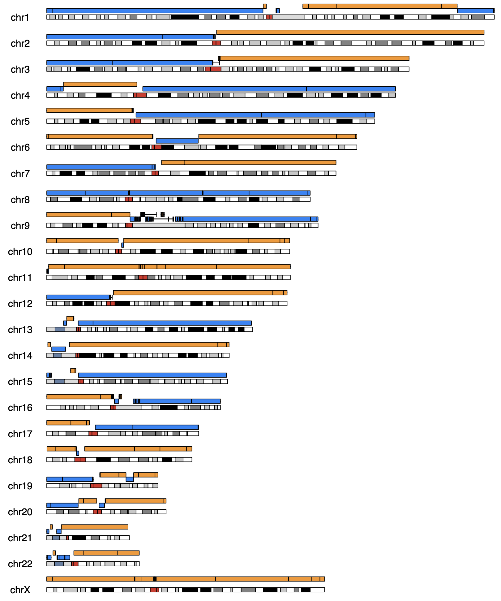

# De novo genome assembly of human cell line CHM13 nanopore ultra-long reads using Shasta

## Motivation

Advances in Oxford Nanopore Technologies (ONT) sequencing, base-calling, and new Shasta releases are outpacing the scientific publishing cycle. We aim to update users on the state-of-the-art using the latest and greatest ONT data assembled with Shasta. This release encompassed our latest assembly of CHM13, the AssemblySummary.html, and Assembly.gfa, along with an evaluation of the assembly. We assembled 120x ultra-long nanopore reads of CHM13 using Shasta 0.9.0 with the iterative assembly mode to produce a haploid de novo genome assembly.

## Methods

We downloaded publicly available reads created by the ["Telomere-to-Telomere" (T2T) Consortium](https://sites.google.com/ucsc.edu/t2tworkinggroup) to assemble CHM13. For a description of sequencing methods by the T2T Consortium, please see https://github.com/marbl/CHM13#oxford-nanopore-data. Release 8 of the data was re-called with Guppy v5.0.7 in super accuracy mode.

### T2T CHM13 rel8 reads

https://s3-us-west-2.amazonaws.com/human-pangenomics/T2T/CHM13/nanopore/rel8-guppy-5.0.7/reads.fastq.gz

We assembled the reads using Shasta 0.9.0 (Shafin et al., 2020) in the iterative assembly mode by calling the Nanopore-Sep2020 configuration, plus additional command line options listed below. We ran the assembly on [McCloud](https://mccloud.czi.technology/), a service that runs Shasta in the cloud.

### Shasta command line options

    --Reads.minReadLength 50000 --Kmers.k 10 --MinHash.minHashIterationCount 100
    --Align.minAlignedFraction 0.35 --Align.minAlignedMarkerCount 600
    --Align.maxSkip 50 --Align.maxDrift 30 --Align.maxTrim 30
    --ReadGraph.creationMethod 0 --ReadGraph.maxAlignmentCount 12
    --ReadGraph.crossStrandMaxDistance 0
    --MarkerGraph.refineThreshold 0 --MarkerGraph.minCoveragePerStrand 3
    --MarkerGraph.simplifyMaxLength 10,100,1000,10000 --Assembly.iterative
    --Assembly.pruneLength 10000 --Assembly.consensusCaller Bayesian:guppy-5.0.7-a

## Assembly files

Available for download from Dryad [https://datadryad.org/stash/dataset/doi:10.5068/D1GQ3S](https://datadryad.org/stash/dataset/doi:10.5068/D1GQ3S)

**Genome assembly file**
Assembly of CHM13 in FASTA format (one strand only).
shasta_0.9.0_chm13_assembly.fasta

**Genome assembly summary file**
Assembly summary information in html format.
AssemblySummary.html

**Graphical fragment assembly file**
Assembly in GFA format (one strand only).
Assembly.gfa

**Assembly evaluation**
Results of our evaluation of the assembly using QUAST and asmgene presented in tables and figures.
shasta_0.9.0_chm13_evaluation.pdf

## Evaluation

**Table 1.** Summary of the size, contiguity, correctness, and completeness statistics for CHM13 Shasta assembly. We evaluated the assembly with [QUAST](http://quast.sourceforge.net/quast.html) 5.1.0rcr1 (Gurevich et al., 2013) using [T2T-CHM13 v1.1](https://www.ncbi.nlm.nih.gov/assembly/GCA_009914755.3/) as the reference (Nurk _et al._, 2022).

| Assembly size (Gb) | N50 (Mb) | NG50 (Mb) | NGA50 (Mb) | mismatches per 100 kbp | indels per 100 kbp | Genome fraction |
| ------------------ | -------- | --------- | ---------- | ---------------------- | ------------------ | --------------- |
| 2.96               | 91.98    | 91.98     | 87.79      | 16                     | 42                 | 96.84           |

**Table 2.** Assembly gene completeness metrics from a asmgene reference-based analysis (Li, 2018) using Ensembl transcripts mapped to the T2T-CHM13 v1.1 reference and the Shasta 0.9.0 assembly. This analysis is similar to BUSCO, but uses all the genes in the human genome.

| Metric   | Description                                        | genesToReference | geneToAssembly | Percent |
| -------- | -------------------------------------------------- | ---------------- | -------------- | ------- |
| full_sgl | Complete single-copy genes                         | 34582            | 34480          | 99.71%  |
| full_dup | Misassembled as multi-copy genes                   | 0                | 4              | 0.01%   |
| frag     | Fragmented genes                                   | 0                | 4              | 0.01%   |
| part50+  | Genes mapped over 50% of their length              | 0                | 28             | 0.08%   |
| part10+  | Genes mapped over 10% of their length              | 0                | 2              | 0.01%   |
| part10-  | Genes mapped below 10% of their length or unmapped | 0                | 64             | 0.19%   |
| dup_cnt  | Fraction of missing multi-copy genes               | 1172             | 1101           | 6.06%   |

**Figure 1.** NGx plot showing contig lengths and their cumulative length in order of descending contig size for CHM13 reads assembled with Shasta 0.9.0 (blue line), CHM13 reads assembled with Shasta 0.1.0 (green; Shafin et al., 2020) and the chromosome arm lengths of theT2T- CHM13 v1.1 assembly (purple). The Shasta 0.9.0 assembly has three contigs that span nearly the length of whole chromosomes. Plotted using a custom script available at https://github.com/rlorigro/GFAse/blob/main/scripts/plot_ngx.py.

**Figure 2.** Single-stranded GFA of CHM13 rel8 ONT reads assembled with Shasta 0.9.0. Contigs are colored and labeled according to their corresponding human chromosome number and arm (p=short,q=long). Plotted using Bandage (Wick _et al._, 2015).

**Figure 3.** Assembled contigs are plotted in blue and orange above chromosome ideograms of CHM13 T2Tv1.1 reference. Three chromosomes were assembled in essentially one contig (chr8, chr11, chrX), minus the telomeres, and with small gaps in centromeric higher-order repeats (HORs). Thirty chromosome arms are reconstructed in one contig, minus telomeres. However, gaps in the assembly remain in difficult to assembly regions. For example, the acrocentric arms of chr13 and chr15; pericentromeric regions in chr1, chr9 and chr16; and the centromeres of chr17, chr18, chr19, and chr22. The ideogram was plotted in R using the script: https://github.com/mrvollger/asm-to-reference-alignment/blob/main/workflow/scripts/ideogram.R

## References

Gurevich,A. et al. (2013) QUAST: quality assessment tool for genome assemblies. _Bioinformatics_, **29**, 1072–1075.
{: .paper-reference}

Li,H. (2018) Minimap2: pairwise alignment for nucleotide sequences. _Bioinformatics_, **34**, 3094–3100.
{: .paper-reference}

Nurk,S. et al. (2022) The complete sequence of a human genome. _Science_, **376**, 44–53.
{: .paper-reference}

Shafin,K. et al. (2020) Nanopore sequencing and the Shasta toolkit enable efficient de novo assembly of eleven human genomes. _Nat. Biotechnol._, **38**, 1044–1053.
{: .paper-reference}

Wick,R.R. et al. (2015) Bandage: interactive visualization of de novo genome assemblies. _Bioinformatics_, **31**, 3350–3352.
{: .paper-reference}
